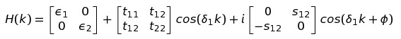
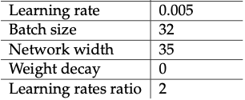

# Hamiltonian Reconstruction

This repository contains the code necessary to reproduce the results presented in the Master's thesis "Deep learning for the parameter estimation of tight-binding Hamiltonians" by Andrea Cacioppo.

## Abstract 

The code available at this repository implements an algorithm whose purpose is the recovery of the Hamiltonian of a crystal in the tight-binding approximation given its electronic bands. The class of Hamiltonians which can currently be recovered is represented by the matrix

The electronic bands are synthetically generated by taking the eigenvalues of this matrix.

## Getting Started

To get the running code clone or download the repository into your local computer.

### Prerequisites

Python, PyTorch and TensorboardX need to be installed.

## Structure of the code

The file to execute is named main.py, while the file containing all the tunable parameters is named CustomModules/Parameters.py, the latter is the only file to be modified.

## Running the tests

In CustomModules/Parameters.py:

- Set the parameters of the artificial Hamiltonian
- Set the initial guesses for the Hamiltonian parameters
- Set the values of the hyperparameters
- Set additional parameters

To read the results:

- In order to read the obtained Hamiltonian parameters and the training procedure run on a terminal "tensorboard --logdir /path/HamiltoninReconstructionThesis/Tensorboard_1d" and open the indicated link in a browser to read the results.

### Recommended hyperparameters

A good choice for the hyperparameters is the following:

## Author

* **Andrea Cacioppo** 

## Acknowledgements

The content of this work is the implementation of a method initially proposed by Dr. Patrick Xian, Vincent Stimper and Arash Mehrjou. My thanks also go to to Vincent, Arash and Dr. Stefan Bauer for the code writing support.
